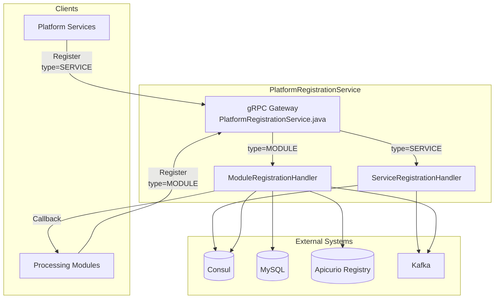
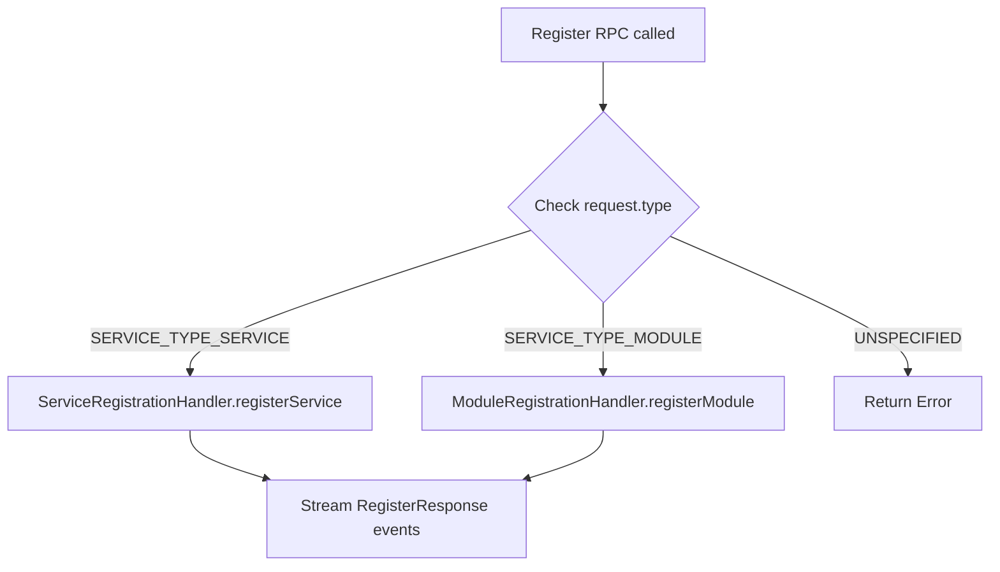
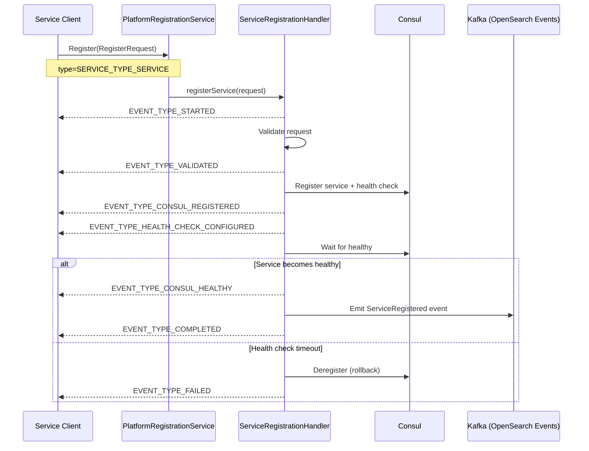
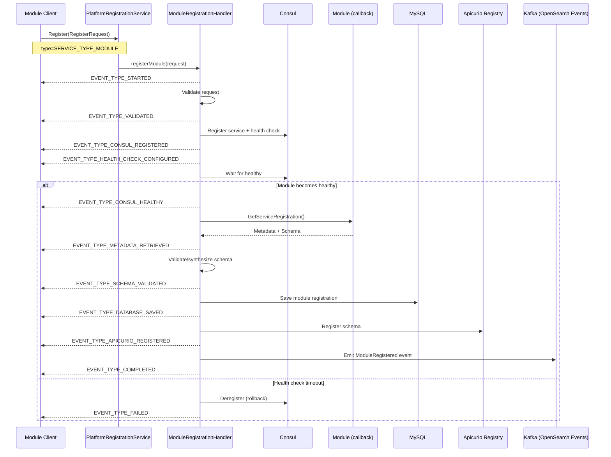
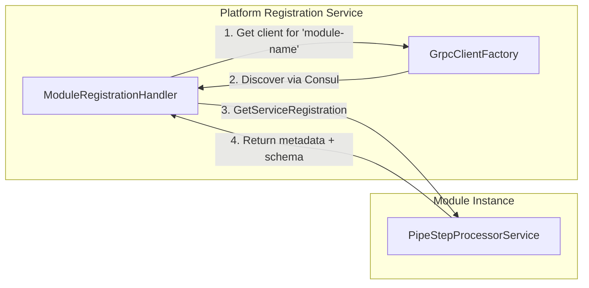
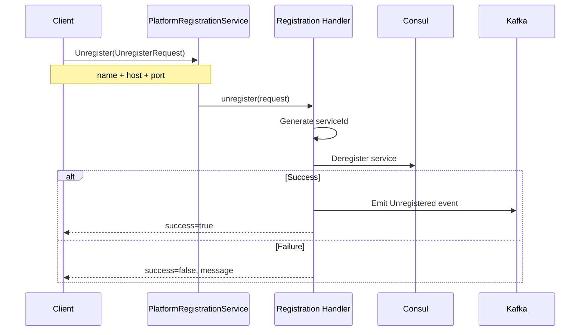
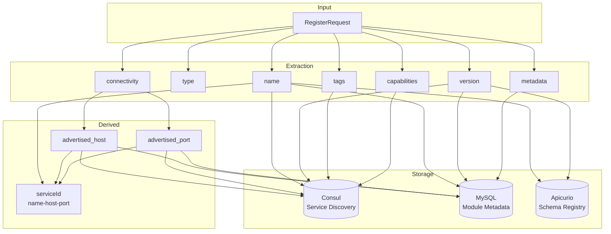

# Platform Registration Service - Registration Flow Design

## Overview

The Piplestream AI Platform is language agnoistic, so the quarkus features that enable gRPC services to be dynamically discovered and registered with Consul are not available.  Instead, we use a gRPC gateway to route requests based on the `ServiceType` field.  This document describes the registration flow for both services and modules.

Given the the module API is 100% grpc and language ignostic, the platform also requires a way to register these services with Consul and register module schemas with Apicurio Registry.

However, forcing developers to create integrations with Consul and Apicurio Registry is not ideal.  Instead, we want to provide a unified API for registering both services and modules with the platform.  This way, a developer only needs to create 2 functions to create a full pipeline without any additional integrations.   Everything is pure gRPC and the platform handles the rest.

The Platform Registration Service provides a **unified API** for registering both services and modules with the platform. The API uses a single `Register` RPC that routes internally based on the `ServiceType` field to differentiate between services and modules.  The `Register` RPC returns a stream of `RegisterResponse` events that provide real-time progress and error messages..

## Proto API

```protobuf
service PlatformRegistrationService {
  // Unified registration - routes based on type field
  rpc Register(RegisterRequest) returns (stream RegisterResponse);
  
  // Unified unregistration
  rpc Unregister(UnregisterRequest) returns (UnregisterResponse);
}

message RegisterRequest {
  string name = 1;           // Service or module name
  ServiceType type = 2;      // SERVICE_TYPE_SERVICE or SERVICE_TYPE_MODULE
  Connectivity connectivity = 3;
  string version = 4;
  map<string, string> metadata = 5;
  repeated string tags = 6;
  repeated string capabilities = 7;
}

message Connectivity {
  string advertised_host = 1;
  int32 advertised_port = 2;
  optional string internal_host = 3;
  optional int32 internal_port = 4;
  bool tls_enabled = 5;
}

message UnregisterRequest {
  string name = 1;
  string host = 2;
  int32 port = 3;
}
```

## High-Level Architecture



## Request Routing

The `PlatformRegistrationService` gRPC service receives all registration requests and routes them based on the `type` field:



## Service Registration Flow

Services are platform components that don't require schema management (e.g., `mapping-service`, `account-service`).



### Service Registration Events

| Event | Description |
|-------|-------------|
| `EVENT_TYPE_STARTED` | Registration process initiated |
| `EVENT_TYPE_VALIDATED` | Request validation passed |
| `EVENT_TYPE_CONSUL_REGISTERED` | Successfully registered with Consul |
| `EVENT_TYPE_HEALTH_CHECK_CONFIGURED` | gRPC health check configured |
| `EVENT_TYPE_CONSUL_HEALTHY` | Service passed Consul health checks |
| `EVENT_TYPE_COMPLETED` | Registration complete |
| `EVENT_TYPE_FAILED` | Registration failed (with error_detail) |

## Module Registration Flow

Modules are document processing components that implement `PipeStepProcessorService` and require schema management via Apicurio Registry.



### Module Registration Events

| Event | Description |
|-------|-------------|
| `EVENT_TYPE_STARTED` | Registration process initiated |
| `EVENT_TYPE_VALIDATED` | Request validation passed |
| `EVENT_TYPE_CONSUL_REGISTERED` | Successfully registered with Consul |
| `EVENT_TYPE_HEALTH_CHECK_CONFIGURED` | gRPC health check configured |
| `EVENT_TYPE_CONSUL_HEALTHY` | Module passed Consul health checks |
| `EVENT_TYPE_METADATA_RETRIEVED` | Module metadata fetched via callback |
| `EVENT_TYPE_SCHEMA_VALIDATED` | JSON schema validated or synthesized |
| `EVENT_TYPE_DATABASE_SAVED` | Registration persisted to MySQL |
| `EVENT_TYPE_APICURIO_REGISTERED` | Schema registered in Apicurio |
| `EVENT_TYPE_COMPLETED` | Registration complete |
| `EVENT_TYPE_FAILED` | Registration failed (with error_detail) |

## Module Callback Flow

When a module registers, the platform makes a callback to fetch metadata:



The callback retrieves:
- `module_name` - Unique identifier
- `version` - Semantic version  
- `json_config_schema` - JSON Schema for configuration validation
- `display_name` - Human-friendly name
- `description` - Module purpose
- `tags` - Categorization tags
- `dependencies` - External dependencies
- `metadata` - Custom key-value pairs

## Unregistration Flow

Unregistration is simpler and unified for both services and modules:



## Data Flow Summary



## Component Responsibilities

| Component | Responsibility |
|-----------|---------------|
| `PlatformRegistrationService` | gRPC gateway, routes by type |
| `ServiceRegistrationHandler` | Service registration logic |
| `ModuleRegistrationHandler` | Module registration logic with callback |
| `ConsulRegistrar` | Consul service registration |
| `ConsulHealthChecker` | Wait for service health |
| `ModuleRepository` | MySQL persistence |
| `ApicurioRegistryClient` | Schema registry operations |
| `RegistrationGrpcClients` | Dynamic gRPC client for callbacks |
| `OpenSearchEventsProducer` | Kafka event emission |

## Key Design Decisions

1. **Unified API**: Single `Register` method routes by `type`, not separate methods per type
2. **Streaming Response**: Real-time progress via streaming events
3. **Module Callback**: Platform fetches metadata from module rather than client providing it
4. **Schema Management**: Only modules have schemas; managed via Apicurio Registry
5. **Connectivity Abstraction**: `Connectivity` message allows advertised vs internal addresses
6. **Natural Key**: Services identified by `name + host + port` tuple

